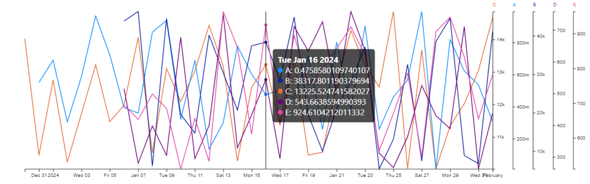

# Linechart Multiple Axis Scaled



## Features

- **Multi-Category Line Chart**: Plot multiple lines, each representing a different category, on the same chart.
- **Customizable Y-Axis**: Automatically scale the y-axis based on the data or manually set the minimum and maximum values.
- **Interactive Tooltips**: Display detailed information for each data point when hovering over the chart.
- **Highlight Functionality**: Click on a category to highlight its corresponding line and data points, reducing the opacity of the other lines for better visual focus.
- **Vertical Line Indicator**: Show a vertical line and tooltip when hovering over the chart, indicating the closest data points across all categories.
- **Formatted Axes**: Use formatted ticks for the y-axis to improve readability, with a customizable format.
- **Dynamic Legend**: Automatically adjust the right margin based on the number of categories, ensuring all legends are displayed without overlapping.


### Setting Up Environment

Before starting creating your first custom visual follow by [this](https://learn.microsoft.com/en-us/power-bi/developer/visuals/environment-setup)
setting up environment instruction.


### Install dev dependencies:

Once you have cloned this repository, run these commands to install dependencies and to connect the visual into powerbi.

```
npm install # This command will install all necessary modules
```

### Start dev app
```
pbiviz start
```

## Formatting Settings

- **General Settings**:
  - `Auto Scale Y`: Enable or disable automatic y-axis scaling.
  - `Min Range Y`: Set the minimum value for the y-axis when `Auto Scale Y` is disabled.
  - `Max Range Y`: Set the maximum value for the y-axis when `Auto Scale Y` is disabled.
  - `Display Points`: Toggle the visibility of data points on the lines.

## Code Overview

### Key Functions

#### visual.ts

- `update(options: VisualUpdateOptions)`: Updates the visual with new data and settings.
- `getVisualData(dataView: DataView, host: IVisualHost, formattingSettings: VisualFormattingSettingsModel): VisualData`: Processes the data from Power BI and prepares it for visualization.
- `drawChart(data: VisualData, host: IVisualHost, formattingSettings: VisualFormattingSettingsModel)`: Draws the line chart, including axes, lines, points, and tooltips.
